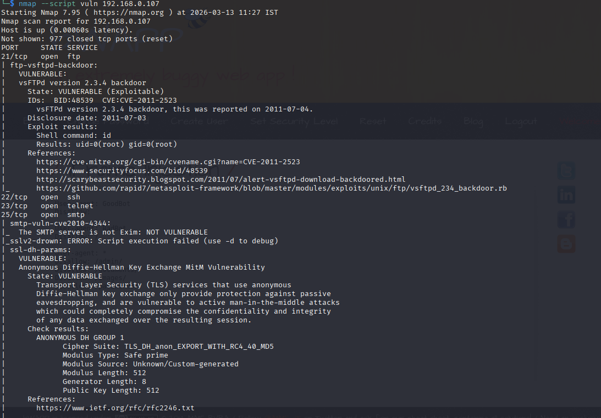
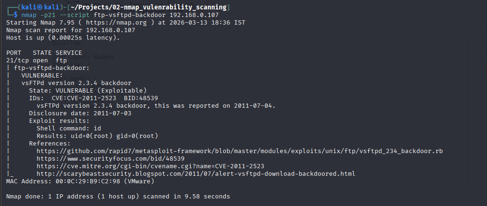
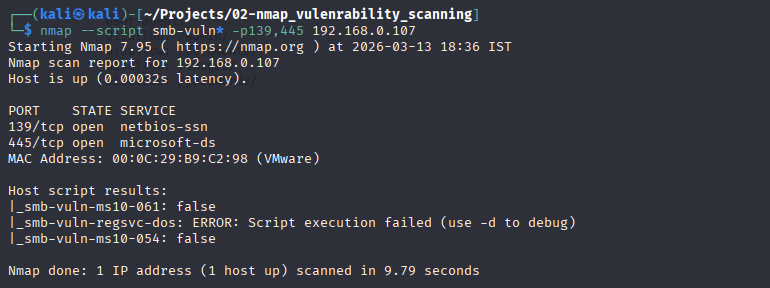
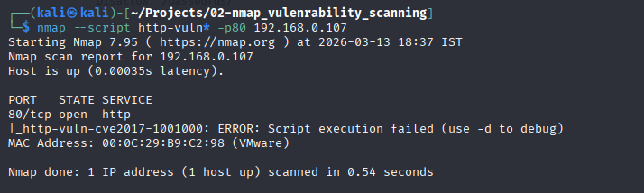

# Vulnerability Assessment using Nmap NSE

## Executive Summary

This project demonstrates a vulnerability assessment performed on a vulnerable Linux machine (Metasploitable2) using the Nmap Scripting Engine (NSE).

The objective of the assessment was to identify exposed services, detect known vulnerabilities, and evaluate the attack surface of the system.

The scan revealed multiple critical vulnerabilities including remote code execution backdoors, weak cryptographic configurations, and web application injection flaws.

Several of the identified vulnerabilities could allow an attacker to gain remote access or compromise sensitive data.

---

## Scope

Target System:

Metasploitable2
IP Address: 192.168.0.107

Scanner System:

Kali Linux

Tool Used:

Nmap 7.95 with NSE vulnerability scripts

---

## Methodology

The vulnerability assessment followed these stages:

1. Port Discovery
2. Service Enumeration
3. Vulnerability Detection using NSE scripts
4. Vulnerability Analysis

Commands used during the scan:

```
nmap --script vuln 192.168.0.107
```

The scan attempted to identify known vulnerabilities by testing services against known exploit signatures.

---

## Scan Evidence

The following scans were conducted during the vulnerability assessment:

Port and vulnerability discovery:

nmap --script vuln 192.168.0.107

Service-specific vulnerability scans:

nmap -p21 --script ftp-vsftpd-backdoor 192.168.0.107

nmap --script http-vuln* -p80 192.168.0.107

nmap --script smb-vuln* -p139,445 192.168.0.107

Full scan output is stored in:

scans/metasploitable_vuln_scan.txt

---

## Scan Screenshots

The following screenshots provide evidence of vulnerability detection:

1. nmap vuln scan \
    

2. ftp backdoor detection \
    

3. smb vulnerability scan \
    

4. http vulnerability scan \
    

---

## Key Vulnerabilities Identified

| Service | Vulnerability             | CVE           | Severity |
| ------- | ------------------------- | ------------- | -------- |
| FTP     | vsFTPd backdoor           | CVE-2011-2523 | Critical |
| IRC     | UnrealIRCd backdoor       | CVE-2010-2075 | Critical |
| RMI     | RMI Remote Code Execution | N/A           | Critical |
| SSL     | POODLE attack             | CVE-2014-3566 | High     |
| TLS     | Logjam vulnerability      | CVE-2015-4000 | High     |
| HTTP    | Slowloris DoS             | CVE-2007-6750 | Medium   |
| Web App | SQL Injection indicators  | N/A           | High     |

Severity levels were determined based on the potential impact and exploitability of the vulnerabilities, following common vulnerability scoring practices similar to CVSS risk ratings.
---

## Vulnerability Details

### vsFTPd Backdoor (CVE-2011-2523)

The FTP service running on port 21 is using vsFTPd version 2.3.4, which contains a malicious backdoor introduced into the source code.

Impact:

An attacker can gain remote root shell access to the system.

Severity: Critical

---

### UnrealIRCd Backdoor

The IRC service appears to be running a trojanized version of UnrealIRCd.

Impact:

Allows attackers to execute arbitrary commands remotely.

Severity: Critical

---

### RMI Remote Code Execution

The Java RMI registry service allows remote class loading from external sources.

Impact:

Attackers may execute arbitrary code on the target system.

Severity: Critical

---

### SSL POODLE Vulnerability (CVE-2014-3566)

The server supports SSLv3, which is vulnerable to padding oracle attacks.

Impact:

Allows attackers to decrypt encrypted communications through a Man-in-the-Middle attack.

Severity: High

---

### Logjam TLS Vulnerability (CVE-2015-4000)

The TLS configuration allows weak Diffie-Hellman key exchange parameters.

Impact:

Attackers can downgrade encryption strength and potentially decrypt communications.

Severity: High

---

### Slowloris Denial of Service (CVE-2007-6750)

The Apache web server is vulnerable to Slowloris attacks.

Impact:

Attackers can exhaust server resources and cause denial of service.

Severity: Medium

---

### SQL Injection Indicators

The scan detected multiple potential SQL injection points within the Mutillidae web application.

Impact:

Attackers may extract sensitive information or manipulate backend databases.

Severity: High

---

## Risk Assessment

The presence of multiple remote code execution vulnerabilities significantly increases the risk level of the system.

Critical services such as FTP and IRC expose backdoor access mechanisms that could allow attackers to gain full system control.

Immediate remediation would be required in a production environment.

---

## Recommendations

To mitigate the identified vulnerabilities, the following actions are recommended:

• Upgrade vulnerable services to patched versions
• Disable insecure services such as Telnet and outdated FTP servers
• Enforce secure TLS configurations and disable weak cipher suites
• Implement web application security controls to prevent SQL injection
• Restrict unnecessary open ports and services

---

## Conclusion

The vulnerability scan revealed multiple high-risk vulnerabilities on the target system. The findings highlight the importance of regular vulnerability assessments to identify exploitable weaknesses before attackers can exploit them.

Future work may include validating selected vulnerabilities in a controlled lab environment to confirm exploitability and reduce false positives.